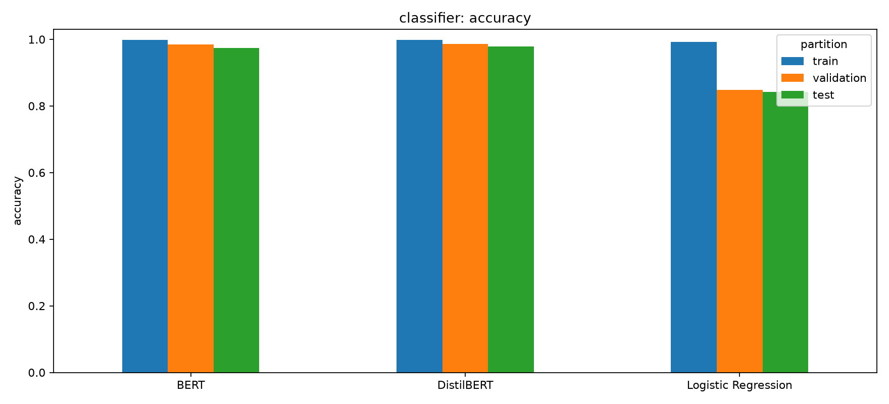
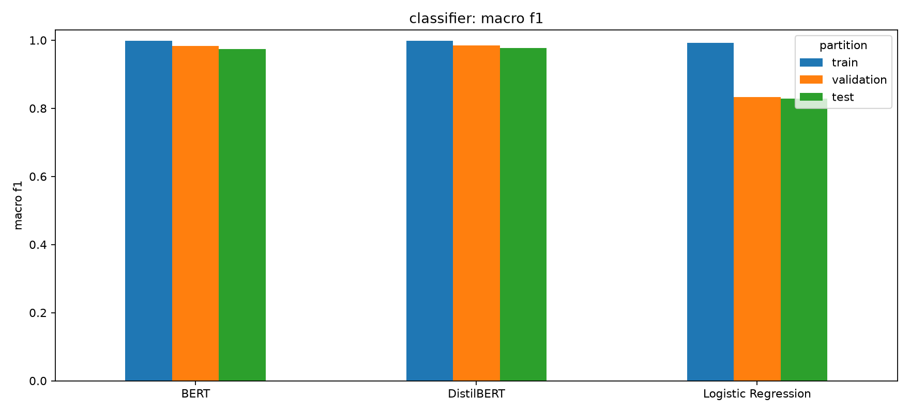
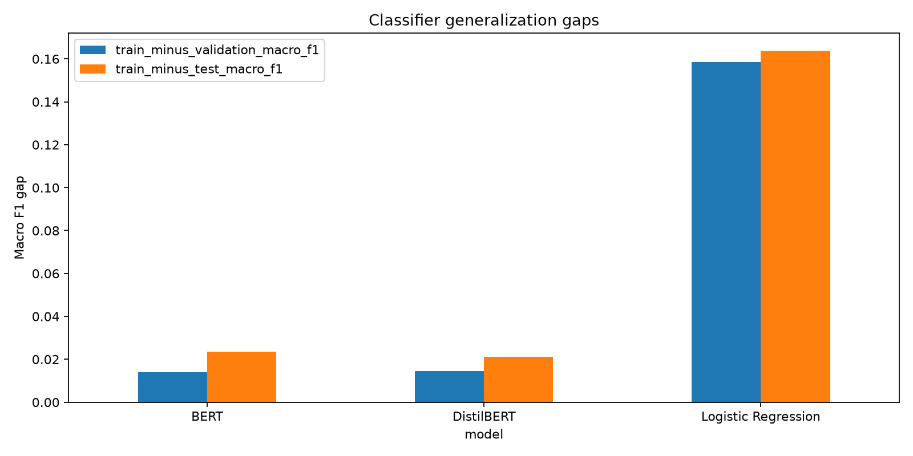
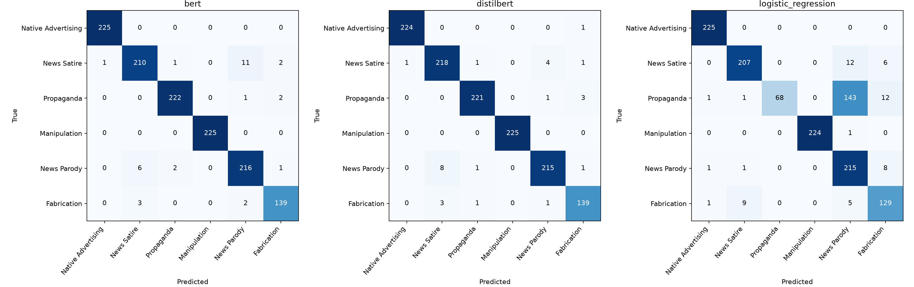
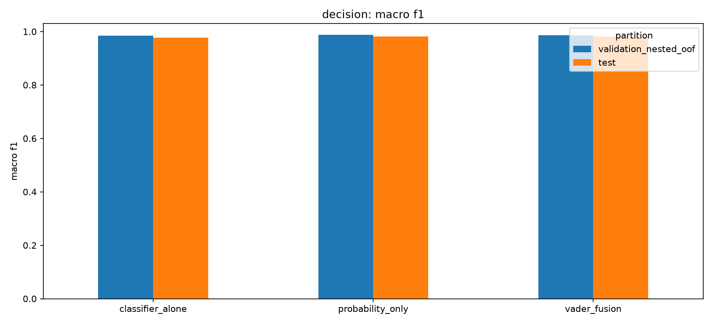
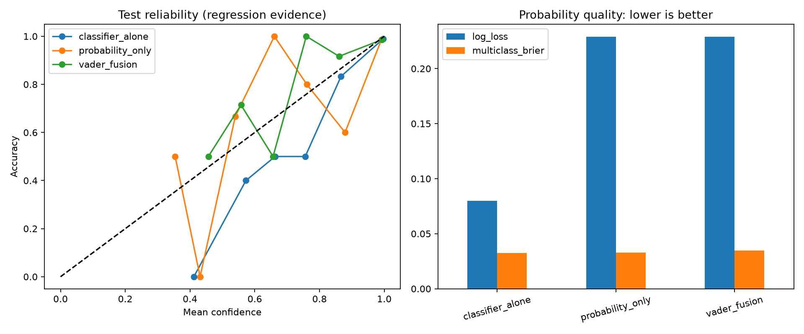
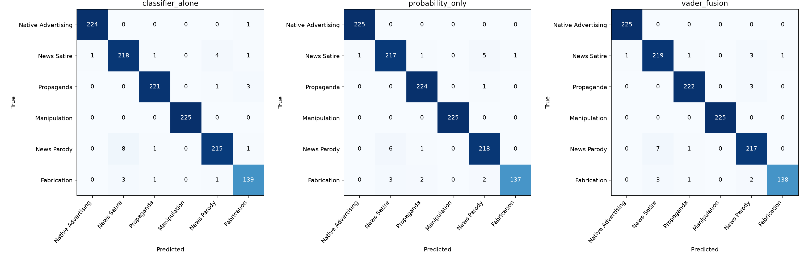
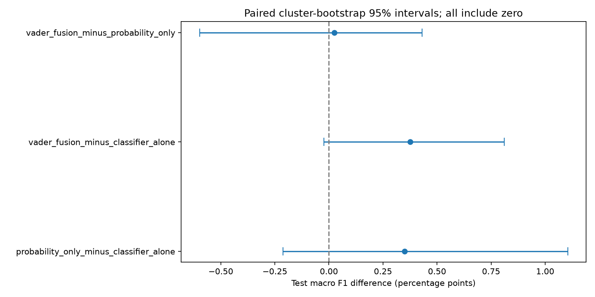
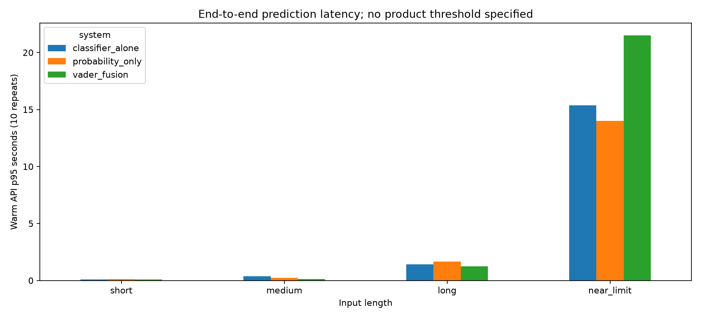

# Final Phases 1–5 report

Phases 1–5 are complete. The model/API artifacts and evaluation evidence are ready for the USER/ADMIN Streamlit upgrade. The upgrade itself is the next implementation phase; existing Streamlit behavior is preserved. Readiness means interface-integration readiness, not independently validated production accuracy or a certified response-time target.

Completed classifier evaluations, A/B/C experiments, 56 passing tests, and the original integrity baseline were reused. No model retraining or full classifier evaluation was repeated. This continuation adds runtime/edge measurements, final integrity verification, comparison figures and this report.

## Phase 1 — Frozen data and classifier evaluation

The fixed dataset contains 8,459 records: TRAIN 5,921; validation 1,269; test 1,269. Class order is Native Advertising, News Satire, Propaganda, Manipulation, News Parody, Fabrication. All metrics below are fractions, not percentages.

| model | split | records | accuracy | macro_f1 | weighted_f1 | log_loss | multiclass_brier |
| --- | --- | --- | --- | --- | --- | --- | --- |
| BERT | train | 5921 | 0.997804 | 0.997846 | 0.997803 | 0.009029 | 0.002827 |
| BERT | validation | 1269 | 0.985028 | 0.983895 | 0.985053 | 0.066631 | 0.026529 |
| BERT | test | 1269 | 0.974783 | 0.974187 | 0.974756 | 0.099988 | 0.040939 |
| DistilBERT | train | 5921 | 0.998818 | 0.998799 | 0.998818 | 0.006854 | 0.001797 |
| DistilBERT | validation | 1269 | 0.985816 | 0.984288 | 0.985891 | 0.059288 | 0.023525 |
| DistilBERT | test | 1269 | 0.978723 | 0.977730 | 0.978738 | 0.079906 | 0.032447 |
| Logistic Regression | train | 5921 | 0.992400 | 0.991837 | 0.992397 | 0.269149 | 0.094156 |
| Logistic Regression | validation | 1269 | 0.847912 | 0.833405 | 0.830448 | 0.618283 | 0.271229 |
| Logistic Regression | test | 1269 | 0.841608 | 0.828034 | 0.825810 | 0.623915 | 0.284609 |

DistilBERT was selected by validation macro F1: 0.984288 versus BERT 0.983895 and Logistic Regression 0.833405. The BERT margin is small; selection does not establish statistically significant superiority. Test scores were not used for this selection. DistilBERT has a train–test macro-F1 gap of 0.021069; Logistic Regression has a substantially larger gap of 0.163804.

## Phase 2 — Decision Layer A/B/C experiment

A = DistilBERT alone; B = DistilBERT probabilities → probability-only Decision Layer; C = DistilBERT probabilities + VADER negative/neutral/positive/compound → Fusion Decision Layer. B/C use StandardScaler and multinomial Logistic Regression. Development uses only the existing validation partition, nested grouped stratified CV (5 outer/4 inner folds), seed 42, and C grid 0.01–100. Final layers are refit on all 1,269 validation records with C=100. Feature order, labels and artifact hashes are recorded in deployment.json.

| system | split | records | accuracy | macro_f1 | weighted_f1 | log_loss | multiclass_brier |
| --- | --- | --- | --- | --- | --- | --- | --- |
| classifier_alone | validation_nested_oof | 1269 | 0.985816 | 0.984288 | 0.985891 | 0.059288 | 0.023525 |
| classifier_alone | train | 5921 | 0.998818 | 0.998799 | 0.998818 | 0.006854 | 0.001797 |
| classifier_alone | validation | 1269 | 0.985816 | 0.984288 | 0.985891 | 0.059288 | 0.023525 |
| classifier_alone | test | 1269 | 0.978723 | 0.977730 | 0.978738 | 0.079906 | 0.032447 |
| probability_only | validation_nested_oof | 1269 | 0.988968 | 0.987802 | 0.988998 | 0.065753 | 0.020943 |
| probability_only | train | 5921 | 0.998311 | 0.998188 | 0.998312 | 0.019101 | 0.003037 |
| probability_only | validation | 1269 | 0.988180 | 0.987060 | 0.988208 | 0.049687 | 0.020166 |
| probability_only | test | 1269 | 0.981875 | 0.981237 | 0.981850 | 0.228842 | 0.032818 |
| vader_fusion | validation_nested_oof | 1269 | 0.987392 | 0.986136 | 0.987437 | 0.071357 | 0.023213 |
| vader_fusion | train | 5921 | 0.998480 | 0.998392 | 0.998481 | 0.018485 | 0.003271 |
| vader_fusion | validation | 1269 | 0.988968 | 0.987797 | 0.988993 | 0.044629 | 0.019309 |
| vader_fusion | test | 1269 | 0.981875 | 0.981486 | 0.981883 | 0.228838 | 0.034654 |

The selected final system is B, probability_only: nested validation OOF macro F1 0.987802, compared with A 0.984288 and C 0.986136. Final-fit validation scores for B/C are resubstitution scores; use nested OOF for their development comparison. TRAIN scores are diagnostics on the base classifier training partition, not fresh generalization evidence.

## Phase 3 — VADER impact and probability quality

On test, A makes 27 errors; B and C each make 23 errors (98.187549% accuracy). C minus B macro F1 is +0.000249 (+0.024893 percentage points), with paired 95% cluster-bootstrap interval [−0.005983, +0.004303]. C minus A macro F1 is +0.003756, interval [−0.000236, +0.008107]. Both intervals include zero. The predefined incremental-benefit criterion is therefore not met. VADER does not provide a demonstrated improvement over the probability-only layer; it remains an explicit experimental option.

B minus A test macro F1 is +0.003507, interval [−0.002122, +0.011040]; this test gain is also uncertain. VADER lowers nested OOF macro F1 relative to B by 0.001667. Test log loss worsens from A 0.079906 to B 0.228842 and C 0.228838; test Brier scores are A 0.032447, B 0.032818, C 0.034654. Better hard-label accuracy does not imply better confidence quality. Probabilities must not be presented as factual certainty.

All TRAIN/validation/test confusion matrices and the decision nested-OOF matrices are available as CSV and PNG. [Complete graph index](graph_index.md). Changed predictions, reliability bins and paired uncertainty are retained in changed_predictions.csv, test_reliability_bins.csv and paired_uncertainty.json. Final result verification rechecks all 21 confusion-matrix totals/accuracies, three classifier probability-file hashes, the fusion-feature hash, deployment metadata and both Decision Layer artifact hashes (final_result_verification.json).

## Phase 4 — Latency and robustness

Environment: Windows-11-10.0.26200-SP0; processor Intel64 Family 6 Model 140 Stepping 1, GenuineIntel; device cpu; PyTorch threads 4. Python API wall time including VADER and decision layer, no UI/network/concurrency; one warm-up per input; 10 repeats; cold includes Python module imports/model loading inside fresh process but not OS process spawn.

| system | seconds_including_imports_and_loading | predicted_label | confidence |
| --- | --- | --- | --- |
| classifier_alone | 34.746631 | Native Advertising | 0.678668 |
| probability_only | 86.634842 | Native Advertising | 0.997692 |
| vader_fusion | 165.281450 | Native Advertising | 0.998157 |

| system | input_size | characters | chunks | repetitions | p50_seconds | p95_seconds | max_seconds |
| --- | --- | --- | --- | --- | --- | --- | --- |
| classifier_alone | short | 101 | 1 | 10 | 0.075070 | 0.092388 | 0.099510 |
| classifier_alone | medium | 791 | 1 | 10 | 0.307767 | 0.377692 | 0.397506 |
| classifier_alone | long | 5939 | 2 | 10 | 0.915877 | 1.401467 | 1.558818 |
| classifier_alone | near_limit | 49999 | 17 | 10 | 12.188693 | 15.368169 | 15.746771 |
| probability_only | short | 101 | 1 | 10 | 0.106941 | 0.115953 | 0.116192 |
| probability_only | medium | 791 | 1 | 10 | 0.199770 | 0.226763 | 0.227134 |
| probability_only | long | 5939 | 2 | 10 | 1.473558 | 1.680059 | 1.802142 |
| probability_only | near_limit | 49999 | 17 | 10 | 8.997275 | 13.997369 | 14.638422 |
| vader_fusion | short | 101 | 1 | 10 | 0.060118 | 0.088742 | 0.108691 |
| vader_fusion | medium | 791 | 1 | 10 | 0.117159 | 0.124360 | 0.125499 |
| vader_fusion | long | 5939 | 2 | 10 | 0.960491 | 1.259117 | 1.405477 |
| vader_fusion | near_limit | 49999 | 17 | 10 | 15.409701 | 21.507196 | 23.815468 |

Cold starts are one fresh process per variant; the protected-workspace integrity scan overlapped this cold-start phase, so cold figures include host/disk contention and are not controlled estimates of incremental Decision Layer overhead. The integrity scan finished before warm measurements were reported. Warm p95 uses only 10 observations per input and is descriptive, not a stable service-level estimate. Measurements are local wall times. No numerical response-time requirement was supplied, so no SLA pass is claimed. BERT and Logistic Regression latency are outside this final-system A/B/C benchmark.

| case | status | reason | contract_valid | category | confidence |
| --- | --- | --- | --- | --- | --- |
| empty | rejected | Input text cannot be empty |  |  |  |
| whitespace | rejected | Input text cannot be empty |  |  |  |
| none | rejected | Input text cannot be empty |  |  |  |
| over_limit | rejected | Please limit each analysis to 50,000 characters |  |  |  |
| punctuation | prediction |  | True | Propaganda | 1.000000 |
| emoji | prediction |  | True | Propaganda | 0.999794 |
| unicode | prediction |  | True | News Parody | 0.997962 |
| non_english | prediction |  | True | News Parody | 0.429892 |
| zero_width | rejected | Input text contains no usable tokens |  |  |  |
| url_only | prediction |  | True | News Parody | 0.991738 |
| negation | prediction |  | True | Propaganda | 0.999914 |
| mixed_tone | prediction |  | True | Propaganda | 1.000000 |
| very_short | prediction |  | True | News Parody | 0.974932 |
| max_characters | prediction |  | True | News Parody | 0.981953 |

Input and numerical robustness; accepted non-English/emoji/URL outputs are not evidence of semantic accuracy. Closed six-category taxonomy is unchanged.

All 14 live edge cases completed: five inputs were rejected (empty, whitespace, None, over 50,000 characters, and zero-width text with no usable tokens); nine returned six finite probabilities summing to one, including exactly 50,000 characters. The checks also cover punctuation, emoji, Unicode, Hebrew, URL-only content, negation, mixed tone and very short text. These verify input/numerical robustness only. Punctuation-only input was classified as Propaganda with confidence near 1.0, and URL-only input as News Parody with confidence 0.991738: these are concrete examples of overconfident out-of-domain behavior, not meaningful semantic validation. An abstention/content-quality gate is a remaining product improvement.

## Phase 5 — Tests, integrity and integration handoff

The saved full suite has 56 passed, 0 failures, 0 errors and 0 skipped, in 90.16 seconds. It covers feature order/ranges, normalization/negation, grouped-fold separation, scaler provenance, saved probability parity, changed model/hash/mapping rejection, missing-sentiment failure, runtime output contracts and existing Streamlit behavior. The suite was reused, not rerun. A post-suite temporary-directory cleanup PermissionError was recorded after success; process exit code was zero (execution_notes.json).

Final integrity: 79 original protected files verified; 62244 continuation-baseline files compared by SHA-256 and size. Protected project content is unchanged. The strict whole-workspace check returned false: 1 changed/removed Codex turn-capture reference and 86 added Git objects. These Git-only differences are consistent with tool-managed capture bookkeeping; they are retained in integrity_verification.json and explicitly assessed in integrity_assessment.json. No original baseline was rewritten. Content SHA256 and sizes for all workspace files except src/, tests/, and new experiment output/model directories. Includes .git, .venv, checkpoints, ZIPs, Models-Artiom-Clean, Streamlit, presentation and historical results. Expanded snapshot begins at this continuation. The original protected_inputs.json establishes earlier continuity only for its listed files.

Final architecture: USER/ADMIN Streamlit interface (next phase) → predict_final(text) → input length/whitespace validation → frozen corrected DistilBERT tokenizer/model → overlapping windows (512 tokens, 16-token overlap; mean probabilities for long text) → six probabilities → saved probability-only scaler/Decision Layer → one category, confidence, six probabilities, chunk count and elapsed time. Explicit classifier_alone and vader_fusion variants remain available for comparison. VADER fusion appends four sentiment features before its own saved layer. Weight hashes, artifact hashes, class mapping and feature order are checked. Inference performs no fitting or downloads.

The USER/ADMIN upgrade can integrate src/final_decision.py:predict_final, whose default follows models/final_decision_v1/deployment.json. Preserve the six-category mapping, display confidence with its caveat, surface input errors, and keep administrative model comparisons separate from the user prediction flow. Role/authentication, UI integration, deployment packaging and concurrent-load testing belong to the upgrade; they are not implemented or certified by this report. The temporary isolated runtime is documented in runtime_environment.json and must be reproduced for deployment.

Files introduced across the saved Phases 1–5 work: src/final_decision.py, src/run_final_decision_experiment.py, src/validate_final_decision.py, src/audit_final_decision_resume.py, src/report_final_decision.py, tests/test_final_decision.py; models/final_decision_v1/ contains deployment metadata and two fitted decision artifacts; results/final_decision_v1/ contains all evidence. tests/test_predict.py was already modified when continuation began. This continuation adds the report generator and final results, and updates validate_final_decision.py to inventory the report generator and require the final evidence checks while explicitly recording the Git-only integrity exception. No inference or training code was changed in this continuation. The pre-existing Models-Artiom-Clean/ and Models-Artiom.zip are not new outputs. [Full created/changed inventory](files_created_or_changed.txt), with sizes and SHA-256 in [file_inventory.csv](file_inventory.csv).

Remaining limitations:

- Validation records influenced frozen classifier checkpoint selection; nested decision-layer CV does not undo this dependence.
- Earlier test/probe results informed Native Advertising dataset correction; test is locked regression evidence, not untouched independent evidence.
- Source-supervised/heuristic labels and source/style correlations limit generalization; sources are not held out wholesale.
- Known groups are separated; undetected semantic overlap may remain.
- Only 144 validation and 144 test Fabrication examples; small differences can be unstable.
- Final decision layers fit validation only. Their train-partition scores are diagnostics on base-classifier training data, not generalization estimates.
- Final-fit validation scores are resubstitution; nested out-of-fold scores are the decision development comparison.
- No independent long-document accuracy benchmark; runtime uses existing overlapping-window mean probabilities.
- Probabilities are assessed for calibration but are not factual verification or guaranteed calibrated confidence.

- Test results are locked regression evidence because earlier test/probe observations informed dataset correction; an untouched, independently labeled external set is still needed.
- No numeric product accuracy/latency targets were supplied. No UI/network/concurrent-load benchmark, production deployment verification or independent long-document/non-English semantic evaluation was performed.
- The closed taxonomy always selects one of six categories; it does not establish truth or provide an unknown/neutral category.
- The integration recommendation prioritizes development macro F1, while test probability quality remains a limitation.
